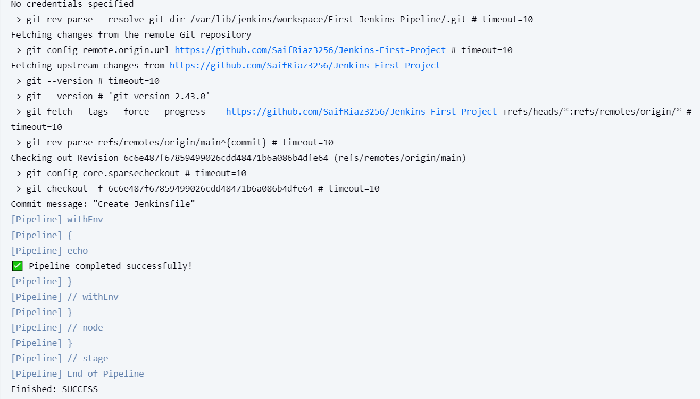

# Jenkins Simple Multi-Stage Pipeline 🚀

This project demonstrates a basic Jenkins Declarative Pipeline that uses Docker containers to build backend and frontend environments separately.

---

## 📁 Project Structure
```
Jenkins-First-Project/
├── Jenkinsfile
└── README.md
```
---

## 🎯 What This Pipeline Does

- **Stage 1: Backend Build**
  - Uses Docker image `maven:3.8.1-openjdk-11`
  - Prints Maven version to simulate a build

- **Stage 2: Frontend Build**
  - Uses Docker image `node:16-alpine`
  - Prints Node.js version to simulate a frontend build

- **Stage 3: Confirmation**
  - Displays a success message

---

## 💡 What You Will Learn

- Writing a Jenkinsfile in Declarative syntax
- Setting up multi-stage pipelines
- Using Docker containers as build agents
- CI/CD best practices and isolation with containerized tools

---

## 🧰 Tools & Technologies

- Jenkins (Installed on EC2)
- Docker
- GitHub
- Maven & Node.js (via containers)

---

## ☁️ How to Install Jenkins on an AWS EC2 Ubuntu Instance

### ✅ Prerequisites
- AWS account
- Create a **t2.micro or larger EC2 instance** (Ubuntu 22.04 or 24.04 recommended)
- Open ports **22 (SSH)** and **8080 (Jenkins)** in Security Group

### 🔧 Steps to Install Jenkins on EC2

1. **SSH into the EC2 instance**
   ```
   ssh -i your-key.pem ubuntu@your-ec2-public-ip
   ```
2.  **Install Java**
   ```  
  sudo apt update
  sudo apt install -y openjdk-17-jdk
   ```

3. **Add Jenkins repo & install Jenkins**
   ```
    curl -fsSL https://pkg.jenkins.io/debian-stable/jenkins.io.key | sudo tee \
      /usr/share/keyrings/jenkins-keyring.asc > /dev/null
    
    echo deb [signed-by=/usr/share/keyrings/jenkins-keyring.asc] \
      https://pkg.jenkins.io/debian-stable binary/ | sudo tee \
      /etc/apt/sources.list.d/jenkins.list > /dev/null
    
    sudo apt update
    sudo apt install -y jenkins
    ```
4. **Start Jenkins**
  ```
    sudo systemctl enable jenkins
    sudo systemctl start jenkins
  ```
5. **Access Jenkins in your browser**

    Go to: http://your-ec2-public-ip:8080

6. **Unlock Jenkins**
   ```
    sudo cat /var/lib/jenkins/secrets/initialAdminPassword
   ```   
   - Copy the password and paste it in the browser to continue setup
   - Install suggested plugins
   - Create admin user and finish setup

7. **Install Docker**
    ```
    sudo apt install -y docker.io
    sudo usermod -aG docker jenkins
    sudo systemctl restart docker
    sudo systemctl restart jenkins
    ```
8. **Install Docker Pipeline plugin**
   
   - Go to Manage Jenkins → Plugin Manager → Available
   - Search Docker Pipeline and install it

## 🚀 How to Run the Pipeline
    
   - Fork or clone this repository to your GitHub
   - In Jenkins, create a New Item → Pipeline
   - Under Pipeline → Definition: Pipeline script from SCM
   - Choose Git
   - Paste your GitHub repo URL
   - Set Script Path: Jenkinsfile
   - Save and build the job
   - Watch your pipeline execute in stages 🎉

## 📸 Jenkins Pipeline Output

```
  [Pipeline] Start of Pipeline
  [Pipeline] stage('Build Backend')
  [Pipeline] docker image: maven:3.8.1-openjdk-11
  ...
  Apache Maven 3.8.1
  Java version: 11.0.11
  ...
  [Pipeline] stage('Build Frontend')
  [Pipeline] docker image: node:16-alpine
  ...
  v16.19.0
  [Pipeline] echo
  ✅ Pipeline completed successfully!
```

